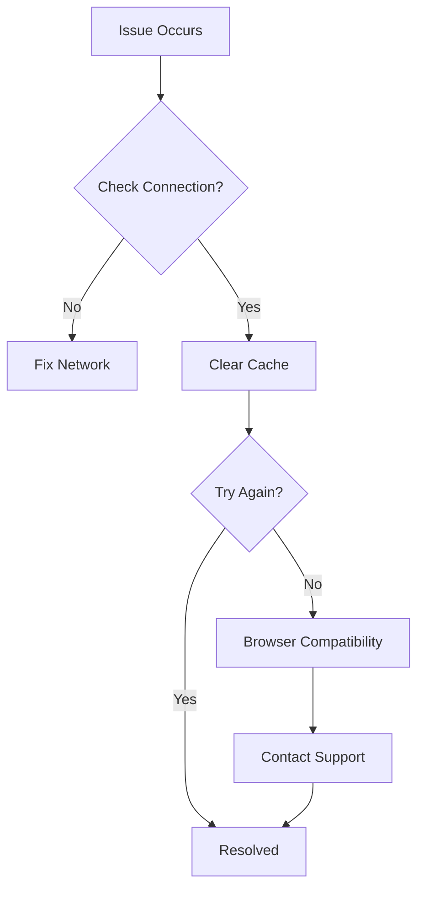

## Overview

Encounter common issues with CitationGenerator.AI? Follow these targeted solutions for login problems, tool errors, and performance hiccups. Start with basic checks like clearing your browser cache and verifying your internet connection. Most issues resolve quickly using the steps below.

<Callout kind="tip">
  Before diving in, refresh the page (`Ctrl+R` or `Cmd+R`) and ensure JavaScript is enabled in your browser.
</Callout>



## Login and Access Issues

Unable to sign in or access tools? Verify your credentials and session status first.

<Steps>
  <Step title="Verify Credentials" icon="user">
    Double-check your email and password. Reset via "Forgot Password?" if needed.
  </Step>
  <Step title="Clear Cookies" icon="trash-2">
    Open developer tools (`F12`), go to Application > Cookies, and delete site cookies.
  </Step>
  <Step title="Incognito Mode" icon="incognito">
    Test in a private browsing window to rule out extensions.
  </Step>
</Steps>

<Callout kind="alert">
  If you see `401 Unauthorized`, your account may be temporarily locked after multiple failed attempts. Wait 15 minutes.
</Callout>

## Tool Errors and Retries

Citation generation or paraphrasing fails? Rate limits and input errors are common culprits.

### Common Error Codes

| Error Code | Description | Solution |
|------------|-------------|----------|
| `429 Too Many Requests` | Rate limit exceeded | Wait 60 seconds and retry |
| `422 Unprocessable Entity` | Invalid input format | Check source URL or text length (`<5000` characters) |
| `500 Internal Server Error` | Temporary outage | Refresh and try again in 5 minutes |

<CodeGroup tabs="Console Log,Network Tab">
  ```javascript
  // Check browser console for errors
  console.error("Citation API failed:", error.response?.status);
  ```
  ```javascript
  // Inspect network tab for failed requests
  fetch("https://api.citationgenerator.ai/v1/cite", {
    method: "POST",
    headers: { "Authorization": "Bearer YOUR_API_KEY" }
  }).catch(err => console.log(err));
  ```
</CodeGroup>

Retry with exponential backoff:

<Steps>
  <Step title="First Retry" icon="refresh-cw">
    Click "Generate Citation" again immediately.
  </Step>
  <Step title="Wait and Retry" icon="clock">
    Pause 30 seconds, then attempt once more.
  </Step>
  <Step title="Switch Tool" icon="tool">
    Use an alternative like MLA instead of APA temporarily.
  </Step>
</Steps>

## Performance and Browser Compatibility

Slow loading or crashes? Ensure your browser meets requirements.

### Supported Browsers

| Browser | Minimum Version | Notes |
|---------|-----------------|-------|
| Chrome | 110+ | Fully supported |
| Firefox | 109+ | Recommended |
| Safari | 16+ | macOS only |
| Edge | 110+ | Chromium-based |

<Tabs>
  <Tab title="Chrome/Edge" icon="chrome">
    <Steps>
      <Step title="Update Browser">
        Go to `chrome://settings/help` and install updates.
      </Step>
      <Step title="Disable Extensions">
        Visit `chrome://extensions/` and toggle off ad blockers.
      </Step>
    </Steps>
  </Tab>
  <Tab title="Firefox" icon="firefox">
    <Steps>
      <Step title="Clear Cache">
        Menu > Settings > Privacy > Cookies and Site Data > Clear Data.
      </Step>
      <Step title="Safe Mode">
        Help > Restart with Add-ons Disabled.
      </Step>
    </Steps>
  </Tab>
  <Tab title="Safari" icon="apple">
    Develop > Empty Caches, then reload the page.
  </Tab>
</Tabs>

<ExpandableGroup>
  <Expandable title="Advanced Performance Tips" default-open="false">
    Monitor resource usage in DevTools Performance tab. Close heavy tabs and ensure `>4GB` RAM available. For grammar checks exceeding `10k` words, split into smaller sections.
  </Expandable>
</ExpandableGroup>

<Columns cols={2}>
  <Card title="Still Stuck?" icon="help-circle" href="mailto:support@citationgenerator.ai">
    Email support with error screenshots and browser details.
  </Card>
  <Card title="Status Page" icon="activity" href="https://status.citationgenerator.ai" target="_blank">
    Check for ongoing incidents.
  </Card>
</Columns>